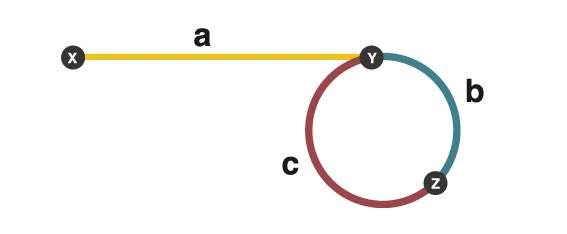

### Note
[題目](https://leetcode.com/problems/find-the-duplicate-number/description/)

- 這題的關鍵要把它想成偵測 linked list 的 cycle begin → fast and slow pointer
- 每一個 nums 的數值是 next 指到的 index
- 假設 fast, slow 相遇的點在 z，則 a = c

    → 因為 fast 會走過 2(a + b) = a + b + nF，所以 a + b = nF → a = nF - b（n 代表圈數, F 代表圓週長）

    → 因為 n 是多少都沒差，所以可以先假設 n = 1

    → a = F - b = (b + c) - b = c

- 因為 a = c 所以一個從頭，一個從相遇的地方開始走，最後相遇的地方就會是 cycle begin (Duplicate number)

    